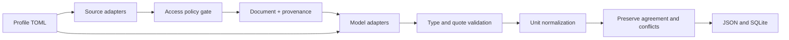

# Kiến trúc và quyết định

## Ranh giới

Lõi không biết tàu chiến. Profile định nghĩa entity và thông tin muốn lấy; connector định nghĩa
cách lấy tài liệu; model adapter định nghĩa cách trích xuất. `Document` là văn bản cùng nguồn gốc.
`Model.extract` trả các claim. Validator không tin trường/tài liệu do model tự nhận:
pipeline tự gắn URL, revision và model vào claim đã kiểm tra.

Model không được quyết định URL tiếp theo, quyền truy cập hoặc gọi công cụ.
Nội dung web được gửi như dữ liệu không tin cậy, với system prompt cố định.
Đây là giảm bề mặt prompt injection, không bảo đảm model luôn diễn giải đúng dữ liệu.

## Vì sao chọn cách này

1. Python standard library để khung chạy ngay trên máy hiện tại, dễ thay thư viện về sau.
2. TOML cho profile, tránh hardcode schema tàu vào cơ sở dữ liệu và prompt chung.
3. Chạy tuần tự có pacing thật theo host, không dùng semaphore để giả làm rate limit.
4. So sánh nhiều model giữ từng claim; không nâng confidence bằng bỏ phiếu thiếu cơ sở.
5. SQLite lưu payload từng run trước khi có nhu cầu truy vấn phân tích phức tạp.
6. Không suy diễn biến thể/timeframe. Profile tách standard/full-load displacement;
   nếu nguồn có nhiều biến thể, giữ khoảng được nêu hoặc để người dùng review.

## Thêm module và adapter

- Module mục đích: copy TOML, đổi entity, sources và fields; chạy `check` rồi fixture test.
- Source: implement `collect(config) -> list[Document]`, đăng ký `make_source` và config validator.
  Mọi tải web phải dùng `Access`; giới hạn số document phải được áp dụng trước tải.
- Model: implement `name`, `extract(document, fields)`, đăng ký `make_model` và config validator.
  Không cấp source access cho model. Model phải trả value có kiểu JSON và quote nguyên văn.
- Unit mới: thêm vào `UNITS`, kiểm tra đúng chiều và test conversion (đặc biệt mass vs force).

## Các bước phát triển tiếp theo

1. Chunking giữ offset + trích xuất infobox/table riêng + schema cho qualifier/variant/timeframe.
2. JSON Schema đầy đủ, model capability negotiation, fallback có ngân sách và log lý do.
3. Source API được phê duyệt, discovery qua search API, giấy phép/attribution theo document.
4. Cache theo URL/revision, resume/checkpoint và giới hạn tổng thời gian/chi phí.
5. Review UI cho bằng chứng và mâu thuẫn; bộ benchmark gán nhãn trước khi tự chọn model.
6. Harden transport nếu triển khai server: pin DNS/egress, kiểm soát tài nguyên, auth và quota.

Không tự thêm các tầng này vào scaffold vì cần dữ liệu thật và yêu cầu vận hành để chọn đúng.

## Tài liệu giao thức đã tham khảo

- [MediaWiki parse API](https://www.mediawiki.org/wiki/API:Parsing_wikitext)
- [MediaWiki language links](https://www.mediawiki.org/wiki/API:Langlinks)
- [Ollama chat](https://docs.ollama.com/api/chat)
- [Robots Exclusion Protocol](https://www.rfc-editor.org/rfc/rfc9309)

`urllib.robotparser` là implementation stdlib, không tuyên bố tuân thủ hoàn chỉnh mọi trường hợp RFC.
